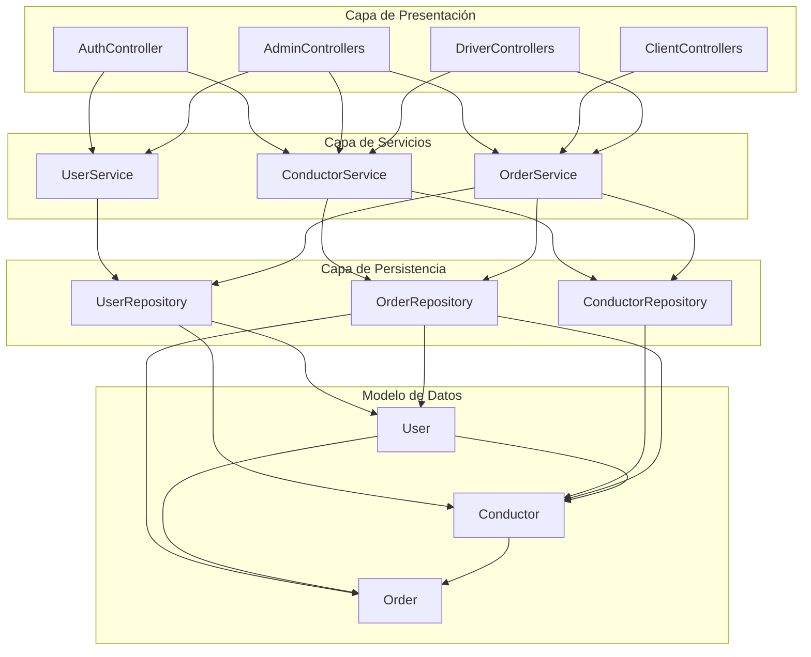
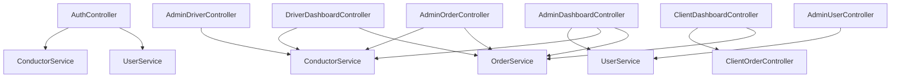
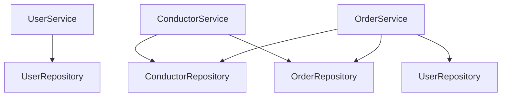
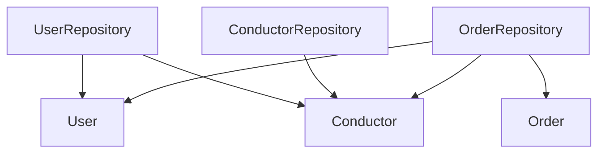
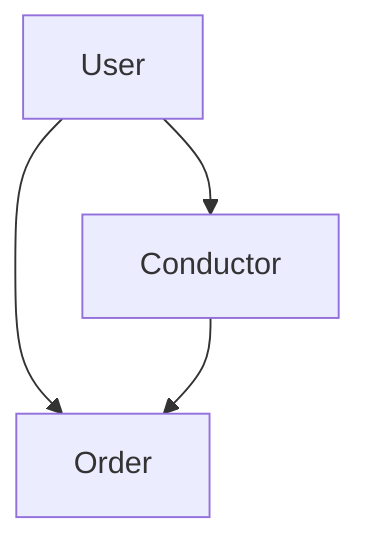
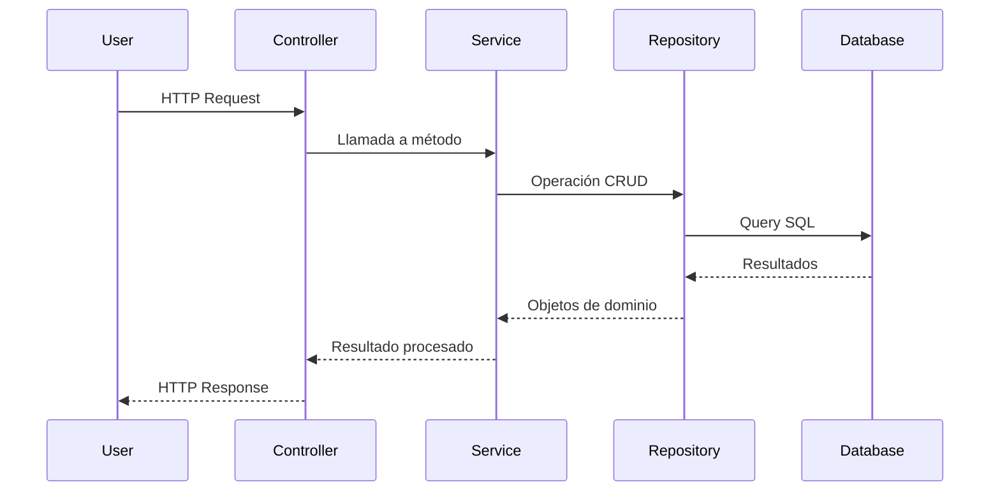

# Diagramas de Arquitectura

## Diagrama de Capas

## Diagrama de Controladores

## Diagrama de Servicios

## Diagrama de Repositorios

## Diagrama de Modelos

## Flujo de una Operación Típica

## Herramientas para Visualizar los Diagramas

1. **GitHub**: Los diagramas se renderizarán automáticamente en GitHub cuando veas el archivo Markdown.

2. **Mermaid Live Editor**: 
   - Ve a [Mermaid Live Editor](https://mermaid.live)
   - Copia y pega el código de cualquier diagrama
   - Verás el diagrama renderizado en tiempo real

3. **VS Code**:
   - Instala la extensión "Markdown Preview Mermaid Support"
   - Abre el archivo en VS Code
   - Usa la vista previa de Markdown (Ctrl+Shift+V)

4. **Documentación Local**:
   - Los diagramas se pueden incluir en tu documentación técnica
   - Útiles para explicar la arquitectura a nuevos desarrolladores
   - Ayudan a mantener la consistencia del código 